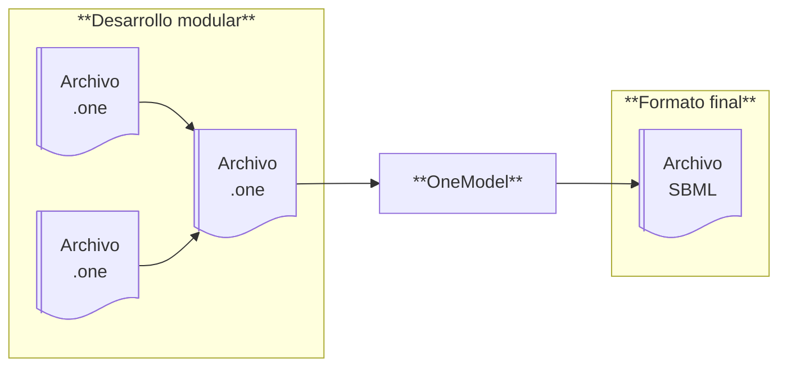
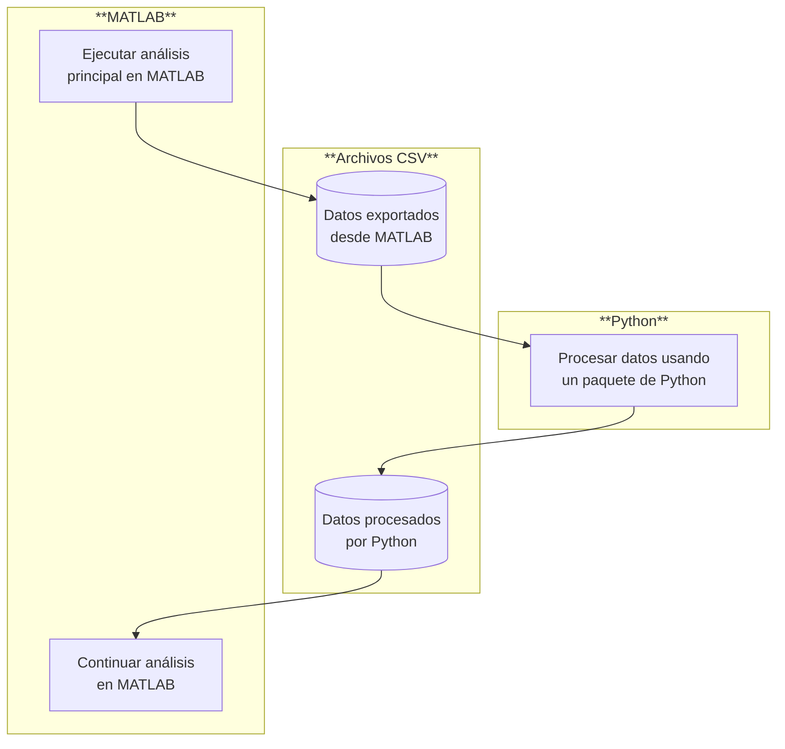

## Resumen

Soy **Escritor Técnico especializado en Documentación de Software**. Trabajo con investigadores e ingenieros para diseñar, desarrollar y documentar software, herramientas y flujos de trabajo.

En este portfolio encontrarás ejemplos de mi trabajo en:

  - **Documentación de código abierto.** He diseñado y redactado tutoriales, guías prácticas, referencias técnicas y explicaciones para un paquete de YAML para MATLAB, utilizando un flujo de trabajo basado en Docs-as-Code y el método Diátaxis.
  - **Desarrollo de software para investigación.** He desarrollado y documentado OneModel, una herramienta de modelado SBML basada en Python, utilizada en investigaciones académicas revisadas por pares y publicada en PyPI.
  - **Iniciativas educativas.** He diseñado e impartido talleres prácticos sobre interoperabilidad Python-MATLAB y sobre buenas prácticas de desarrollo. Además, soy autor de un blog personal sobre creatividad y trabajo de conocimiento.

También he contribuido a proyectos que no pueden mostrarse públicamente, incluyendo el desarrollo y documentación de herramientas de software para empresas privadas de bioindustria y investigaciones aún no publicadas, como un estándar para la representación de modelos de espacio de estados.

---

## Muestras de trabajo



**Fecha:** 2026  
**Herramientas:** reStructuredText · Sphinx · Git · GitHub · Read the Docs · Diátaxis  
**Audiencia:** Usuarios de MATLAB

### Problema

Gran parte de mi experiencia en documentación técnica proviene de proyectos realizados para empresas privadas o de investigaciones aún no publicadas, lo que limita la posibilidad de incluir muestras completas y actualizadas en un portfolio público.

Para superar esta limitación, decidí documentar un paquete de YAML para MATLAB desarrollado por un tercero y de código abierto. Este paquete permite leer y escribir archivos YAML en MATLAB, una funcionalidad que no está disponible de forma nativa.

Este proyecto tuvo dos objetivos principales:

  - crear una muestra de trabajo moderna y accesible públicamente
  - promover la adopción de YAML en MATLAB mediante documentación clara, bien estructurada y práctica para los usuarios.

### Solución

Inicialmente, el paquete de YAML solo incluía un README con ejemplos de uso y docstrings al estilo MATLAB para sus funciones públicas.

Mi enfoque se centró en ampliar y reestructurar la documentación aplicando el método **Diátaxis**. Para lograrlo, diseñé y redacté el siguiente contenido:

  - **Un nuevo tutorial.** Un recorrido práctico sobre cómo personalizar gráficos de MATLAB usando YAML.
  - **Una nueva guía práctica.** Una guía sobre cómo mantener configuraciones YAML sin duplicar código.
  - **Referencia de API actualizada.** Una referencia revisada y ampliada de la API pública del paquete.
  - **Una nueva explicación.** Una explicación que aclara los distintos roles de los archivos YAML y MAT en los flujos de trabajo de MATLAB.

El objetivo principal de la documentación era motivar a los usuarios a adoptar flujos de trabajo basados en YAML mediante el uso del paquete.

Para lograr este objetivo, creé un repositorio separado, _YAML for MATLAB_, dedicado exclusivamente a la documentación. Este repositorio hace referencia explícita al repositorio original de YAML, pero no incluye su código fuente. Esta separación permitió producir una documentación más completa y orientada al usuario sin estar limitada por el alcance ni la estructura del proyecto original.

La documentación se construyó con **Sphinx** y se publicó en **Read the Docs**. Además, configuré un **entorno de documentación reproducible** para facilitar futuras actualizaciones y fomentar contribuciones de la comunidad.

### Resultados

  - Amplié y reestructuré la documentación utilizando el método de **Diátaxis**.
  - Establecí un entorno de documentación reproducible basado en **Sphinx** para facilitar la colaboración y el mantenimiento a largo plazo.
  - Publiqué la documentación en **Read the Docs** con compilaciones automáticas.
  - Apoyé y promoví la adopción más amplia de **flujos de trabajo basados en YAML** dentro del ecosistema MATLAB.

### Enlaces a las muestras

  - Documentación Página principal de la documentación publicada en Read the Docs
  - Tutorial · Archivo original "Use YAML to style the plot function"
  - Guía práctica · Archivo original "How to maintain YAML configurations without duplication"
  - Referencia de API · Archivo original Índice de la referencia de API
  - Explicación · Archivo original "MAT-file vs. YAML: Where storing data ends and configuration begins"
  - Repositorio en GitHub Repositorio fuente de la documentación





**Fecha:** 2022  
**Herramientas:** Python · TatSu · SBML · Click · Sphinx · Pytest · Git · GitHub · Poetry  
**Audiencia:** Investigadores académicos

### Problema

Durante mi doctorado, una parte central de mi investigación consistió en desarrollar modelos matemáticos y sus correspondientes implementaciones de software. Inicialmente, seguí la práctica estándar de la comunidad de ingeniería de control: construir modelos monolíticos en MATLAB sin depender de librerías externas. Este enfoque funcionaba bien para modelos pequeños, pero resultó poco escalable cuando empecé a trabajar con sistemas más complejos, como modelos multi-escala para representar procesos de bioproducción industrial. 

A medida que aumentaba el tamaño y la complejidad de los modelos, los tiempos de desarrollo crecían de forma significativa, el mantenimiento se volvía cada vez más difícil y el riesgo de introducir errores humanos aumentaba considerablemente.

Evalué varias herramientas de modelado existentes ---incluyendo Simulink, Simscape y OpenModelica--- pero eran demasiado rígidas y propensas a dependencia del proveedor. Teniendo en cuenta estas limitaciones, propuse a mi director de tesis desarrollar una nueva herramienta, OneModel, diseñada específicamente para soportar la construcción incremental y modular de modelos.

### Solución

OneModel es un **paquete de Python** para construir modelos matemáticos de bioprocesos utilizando el estándar SBML. Proporciona un **lenguaje específico de dominio (DSL)** que soporta la construcción incremental y modular de modelos, facilitando su extensión, mantenimiento, reutilización y combinación a lo largo del tiempo. Una vez que un modelo se define usando el DSL, OneModel genera un documento SBML que puede importarse en MATLAB mediante un subpaquete complementario que también desarrollé, SBML2dae.

El principio fundamental detrás de OneModel fue **minimizar el código escrito desde cero**, reduciendo tanto el esfuerzo de desarrollo como de documentación. Para lograrlo, el proyecto aprovecha paquetes y herramientas bien establecidos de la comunidad:

  - **TatSu** para definir y procesar el DSL
  - **SBML** como estándar para representar modelos de bioprocesos
  - **libSBML** para generar documentos SBML
  - **Click** para construir la interfaz de línea de comandos
  - **PyQt5** para construir la interfaz gráfica de usuario
  - **Sphinx** y **Read the Docs** para redactar y publicar la documentación
  - **Poetry** para gestión de dependencias, configuración de entornos virtuales y publicación del paquete
  - **Pytest** para implementar desarrollo guiado por pruebas (TDD).

OneModel se desarrolló de manera colaborativa, con iteraciones continuas basadas en el feedback de mi director de tesis, el equipo de investigación y estudiantes de master y doctorado. Este proceso iterativo permitió que el DSL y las herramientas complementarias evolucionaran en respuesta a necesidades de investigación reales, resultando en una solución de software práctica y fácil de usar.

### Resultados

  - Permitió la creación incremental y modular de modelos SBML complejos, mejorando significativamente la reproducibilidad, mantenibilidad y fiabilidad.
  - Presenté OneModel en conferencias y talleres académicos, incluyendo IWBDA e iGEM, recibiendo comentarios muy positivos de investigadores internacionales.
  - Facilitó el desarrollo de modelos multiescala que sirvieron como base para múltiples publicaciones en mi laboratorio y con colaboradores externos.
  - Recibió reconocimiento durante mi defensa de doctorado por entregar una herramienta de software completa, bien documentada y publicada, con un impacto demostrable en la productividad y calidad de la investigación.

### Enlaces a las muestras

  - Documentación Documentación publicada en Read the Docs
    - Instalación · Archivo original
    - Tutorial de inicio · Archivo original
    - Referencia de la sintaxis de OneModel · Archivo original
  - Repositorio en GitHub   Código fuente, documentación y ejemplos
  - Página en PyPI   Paquete de Python listo para instalar
  - Artículo científico   Artículo revisado por pares que describe OneModel y sus aplicaciones
  - Diapositivas del taller   Diapositivas usadas en los talleres de iGEM e IWBDA para enseñar cómo usar OneModel





**Fecha:** 2024  
**Herramientas:** Python · Jupyter Notebook · MATLAB · Mermaid · Pandoc · Markdown · LaTeX  
**Audiencia:** Investigadores académicos

### Problema

Mi grupo de investigación enfrentaba un cuello de botella técnico. Aunque sus miembros tenían una profunda experiencia en MATLAB, estaban cada vez más desconectados de la comunidad científica más amplia, donde muchas herramientas de vanguardia se desarrollan y publican exclusivamente en Python.

Esto generaba dos problemas principales:

  - **Esfuerzo desperdiciado.** Los investigadores a menudo tenían que reimplementar paquetes existentes de Python en MATLAB.
  - **Coste de oportunidad.** Limitarse a un solo entorno (ya sea Python o MATLAB) significaba perder acceso a herramientas disponibles en el otro.

El objetivo de este proyecto era demostrar que la interoperabilidad Python–MATLAB puede lograrse de manera simple y práctica, sin necesidad de desarrollar software o flujos de trabajo complejos.

### Solución

Diseñé y presenté un taller que evitaba ingeniería de software compleja en favor de un flujo de trabajo práctico basado en archivos. Durante el taller, demostré cómo los **archivos CSV** pueden servir como un puente entre **MATLAB** y **Python**, permitiendo a los investigadores:

  1. Realizar su análisis principal en MATLAB.
  2. Exportar los datos a un archivo **CSV**.
  3. Procesar esos datos en **Python** (a través de **Jupyter Notebooks**) para aprovechar paquetes específicos.
  4. Importar los resultados nuevamente a su entorno familiar en MATLAB.

El taller se estructuró utilizando el método del **Workshop Survival Guide** para asegurar que fuera valioso, atractivo y accesible para todos los participantes. Creé las diapositivas del taller usando **LaTeX**, **Pandoc** y **Mermaid**, logrando una presentación pulida y de alta calidad.

### Resultados

El taller se realizó como parte de un seminario interno del laboratorio y también estuvo abierto a investigadores externos. Asistieron más de 30 investigadores y se obtuvieron resultados inmediatos y tangibles:

  - **100% de éxito.** Todos los participantes completaron el flujo de trabajo de principio a fin durante la sesión.
  - **Cambio cultural.** El resultado más significativo fue un cambio de mentalidad: investigadores que antes eran escépticos de Python comenzaron a verlo como una herramienta útil y accesible, en lugar de una pérdida de tiempo.
  - **Reducción de barreras.** Al priorizar la simplicidad (archivos CSV) sobre la complejidad, disminuí el factor miedo al aprender un nuevo lenguaje y flujo de trabajo.
  - **Preparación para el futuro.** El taller sentó las bases conceptuales para un nuevo estándar del laboratorio para la representación de modelos de espacio de estados.

### Enlaces a las muestras

  - Diapositivas en PDF · Archivo original  Selección de diapositivas que presentan el argumento central sobre la interoperabilidad Python–MATLAB.





**Fecha:** 2022 -- Presente  
**Herramientas:** Zettelkasten · Markdown · Git · GitHub · Hugo · Cloudflare Pages · HTML · CSS  
**Audiencia:** Público general interesado en creatividad y trabajo del conocimiento

### Problema

Como profesional del conocimiento, el valor que genero a través de mi trabajo está directamente ligado a qué tan bien domino estas dos habilidades:

  - **Escribir para pensar.**  
    Usar la escritura como herramienta para pensar y desarrollar ideas.
  - **Escribir para comunicar.**  
    Usar la escritura parar expresar ideas de manera clara y efectiva a los demás.

Con esta idea en mente, empecé un proyecto personal de escritura orientado a practicar y mejorar deliberadamente estas habilidades. 

El desafío principal consistió en identificar un proyecto que permitiera una práctica de escritura sostenida y de alta calidad, al mismo tiempo que minimizara fuentes comunes de fricción y distracción, como herramientas complejas, planificación excesiva o presión externa por el rendimiento. El objetivo era crear un proyecto simple y eficiente que me permitiera dedicar la mayor parte del esfuerzo a la escritura misma.

### Solución

Decidí crear un blog personal centrado en artículos extensos sobre productividad, creatividad y escritura. Esta elección ofrecía varias ventajas: proporcionaba una razón recurrente para practicar la escritura, permitía recibir retroalimentación a través de respuestas de los lectores y métricas de interacción, se conectaba directamente con mi desarrollo como profesional del conocimiento y me daba la oportunidad de contribuir en la comunidad de trabajo del conocimiento.

Abordé el proyecto desde dos enfoques independientes: el sistema de escritura y el desarrollo del sitio web.

**El sistema de escritura.** Adopté un enfoque iterativo, deliberado y experimental, enfocándome en cada etapa en identificar cuellos de botella en mis habilidades y mejorarlos explícitamente.

Mi sistema de escritura resultante combina:

  - **El método Zettelkasten**, que proporciona una base para la investigación rigurosa, el desarrollo incremental de ideas complejas y una clara distinción entre escribir para pensar y escribir para comunicar.
  - **Un conjunto de herramientas personalizadas**, con plantillas, esquemas, guías y otras herramientas de conocimiento, diseñados para apoyar cada fase del proceso de escritura: ideación, estructuración, redacción y edición.
  - **Una mentalidad** orientada hacia un trabajo del conocimiento sostenible y de alta calidad.

Este enfoque me permitió: mejorar continuamente la claridad del pensamiento como requisito para la claridad en la escritura, y aprender a producir contenido valioso para una audiencia.

**El desarrollo del sitio web.** Paralelamente, diseñé un sitio web minimalista, eficiente y escalable, centrado en la legibilidad, la funcionalidad y una experiencia de lectura libre de distracciones. El sitio se desarrolló de manera iterativa, guiado por las necesidades de escritura y publicación. Para cada nueva necesidad, prioricé implementar únicamente las funciones esenciales para evitar la sobreingeniería.

Decisiones técnicas clave incluyeron:

  - Usar un flujo de trabajo basado en **Docs-as-Code**.
  - Usar **Hugo** como generador de sitios estáticos.
  - Implementar un desplique continugo mediante **Git**, **GitHub** y **Cloudflare Pages.**
  - Soportar **contenido multilingüe** (español e inglés).

### Resultados

El resultado es un proyecto sostenible que funciona como un laboratorio personal de mejora continua:

  - Un flujo de trabajo eficiente para escribir y publicar.
  - Un sitio web escalable y mantenible.
  - Más de 70 artículos publicados, incluyendo 24 en inglés.
  - Más de 70,000 palabras en artículos, sin contar notas u otros materiales.
  - Un boletín con más de 400 suscriptores, con retroalimentación positiva recurrente.
  - Los lectores destacan frecuentemente la claridad, profundidad y valor práctico del contenido.

Más allá de su impacto externo, el proyecto ha cumplido su objetivo principal: mejorar de manera sostenible mis habilidades en pensamiento, escritura y diseño de sistemas. También representa una expresión práctica de mi compromiso continuo de usar la escritura como herramienta para pensar con mayor claridad y comunicar con mayor efectividad.

### Enlaces a las muestras

  - El doble filtro del valor · Archivo original   Una herramienta práctica para asegurar que la escritura de no ficción genere valor real, tanto para ti como para tus lectores.
  - El ritual de desconexión reduce el estrés crónico · Archivo original   Un método simple y práctico para cerrar la jornada laboral y reducir el estrés crónico.
  - No compartas algo sin atribuir su autoría creativa · Archivo original   Una explicación sobre por qué la atribución adecuada importa y cómo se conecta con la creación de valor en el trabajo del conocimiento.
  - Por qué leer mucho no es _tan_ importante · Archivo original   Un marco mental para entender cómo se genera valor real a través de la lectura.



---

## Sobre este portfolio

Este portfolio es, en sí mismo, una muestra de trabajo :-)

Fue construido usando **Hugo**, control de versiones con **Git**, alojado en **GitHub Pages** y estilizado con el tema [Hugo ʕ•ᴥ•ʔ Bear](https://github.com/janraasch/hugo-bearblog/) (el cual he personalizado tanto en estilo como en funcionalidad para adaptarlo mejor a un formato de portfolio).

El código fuente completo está disponible públicamente [en GitHub](https://github.com/fernandonobel/fernandonobel.github.io), de modo que otros puedan explorar los detalles de la implementación, reutilizar componentes o usarlo como punto de partida para sus propios portfolios.
