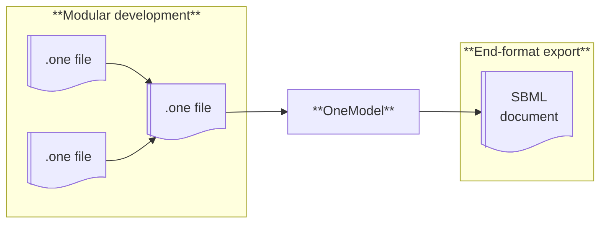
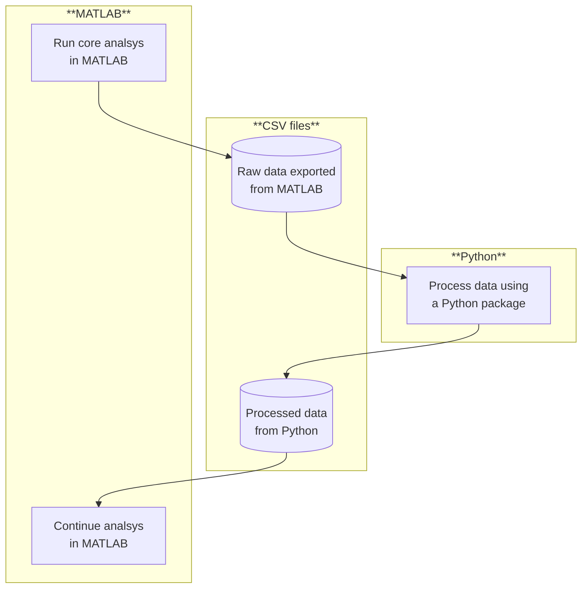



# Porftolio

**Fernando N. Santos-Navarro, PhD**  
Technical Writer  
Software Documentation



---

## Portfolio summary

I'm a **Technical Writer specializing in Software Documentation**. I collaborate with researchers and engineers to design and document software, tools, and workflows.

This portfolio includes examples of my work in:

  - **Open-source documentation**, including Sphinx-based, Diátaxis-driven documentation for the YAML package for MATLAB.
  - **Research software development**, such as OneModel, a Python-based SBML modeling tool used in peer-reviewed academic research.
  - **Educational initiatives**, including hands-on workshops that bridge Python and MATLAB in real research contexts, as well as my long-running blog on creativity and knowledge work.

I've also contributed to projects that cannot be publicly showcased, including the development and documentation of software tools for private bioindustry companies and research that has not yet been published, such as a proposed standard for representing state-space models.

---

## Work samples



**Date:** 2026  
**Tools:** reStructuredText · Sphinx · Git · GitHub · Read the Docs · Diatáxis  
**Audience:** MATLAB users

### Problem

Much of my experience in technical documentation comes from private company projects or unpublished research, which makes it difficult to include complete, current work samples in a public portfolio.

To address this, I chose to document an open-source third-party [YAML package](https://github.com/MartinKoch123/yaml) for MATLAB. This package enables reading and writing YAML files in MATLAB (a feature that is not supported natively).

This project served two purposes:

  - to produce a modern, publicly accessible work sample
  - to promote the adoption of YAML in MATLAB by providing clear, well-structured, and practical documentation for users.

### Solution

Initially, the YAML package provided a README with usage examples and MATLAB-style docstrings for its public functions.

My approach focused on expanding and restructuring the documentation using the **Diátaxis framework**. To achieve this, I designed and authored the following content:

  - **A new tutorial.** A hands-on walkthrough about styling MATLAB plots using YAML.
  - **A new how-to guide.** A guide on maintaining YAML configurations without code duplication.
  - **An updated API reference.** A revised and expanded documentation of the package's public API.
  - **An new explanation.** An explanation to clarify the different roles of YAML files and MAT-files in MATLAB workflows.

The ultimate goal of the documentation was to encourage users to adopt YAML-based workflows by leveraging the YAML package.

To support this effort, I created a separate repository, [yaml-for-matlab](https://github.com/fernandonobel/yaml-for-matlab), dedicated exclusively on documentation. It explicity references the original [yaml repository](https://github.com/MartinKoch123/yaml) but does not include its source code. This separation made it possible to produce more comprehensive, user-focused documentation without being constrained by the scope or structure of the original project.

The documentation is built with **Sphinx** and published on **Read the Docs**. I also set up a **reproducible documentation environment** to facilitate future updates and encourage community contributions.

### Results

  - Expanded and restructured the documentation using the **Diátaxis framework**.
   
  - Established a reproducible, **Sphinx-based documentation** environment to enable collaboration and long-term maintenance.
  
  - Deployed the documentation on **Read the Docs** with automated builds.
  
  - Supported and encouraged broader adoption of **YAML-based workflows** within the MATLAB ecosystem.

### Links to samples

- Documentation The documentation home page deployed on Read the Docs

- Tutorial · Raw file "Use YAML to style the plot function"

- How-to guide · Raw file "How to maintain YAML configurations without duplication"

- API reference · Raw file The API reference index

- Explanation · Raw file "MAT-file vs. YAML: Where storing data ends and configuration begins"

- GitHub repository The documentation source repository





**Date:** 2022  
**Tools:** Python · TatSu · SBML · Click · Sphinx · Pytest · Git · GitHub · Poetry  
**Audience:** Academic researchers  

### Problem

During my PhD, a central part of my research involved developing mathematical models and their corresponding software implementations. Initially, I followed the standard practice of control engineering community: building monolithic models in MATLAB without relying on external dependencies. While this approach was adequate for small models, it quickly became impractical as I scaled up to multi-scale models representing complex processes, such as industrial bioproduction. Development times increased significantly, maintenance become cumbersome, and the risk of human error rose.

I evaluated several existing modeling tools --- including Simulink, Simscape, and OpenModelica --- but found them too rigid and prone to vendor lock-in. Recognizing these limitations, I proposed to my thesis advisor the development of a new tool, OneModel, specifically designed to support incremental, modular model construction.

### Solution

OneModel is a **Python package** for building mathematical models of bioprocesses using the SBML standard. It provides a **domain-specific language (DSL)** that supports incremental and modular model construction, making models easier to extend, maintain, reuse, and combine over time. Once a model is defined using the DSL, OneModel generates an SBML document that can be imported into MATLAB via a companion subpackage I also developed, SBML2dae.

The guiding principle behind OneModel was to minimize code written from scratch, reducing both development and documentation effort. To achieve this, the project leverages well-established community libraries and tools:

  - **TatSu** to define and parse the DSL
  - **SBML** as the standard for representing bioprocess models
  - **libSBML** to generate SBML documents
  - **Click** to build the command-line interface
  - **PyQt5** to build the graphical user interface
  - **Sphinx** and **Read the Docs** to write and publish documentation
  - **Poetry** for dependency management, virtual environment setup, and package publication
  - **Pytest** to implement test-driven development.

OneModel was developed collaboratively, with continuous iterations driven by feedback from my thesis advisor, research team, and both master's and PhD students. This iterative process allowed the DSL and supporting tools to evolve in response to real-world research needs, resulting in a practical and user-friendly software solution.

### Results

  - Enabled the incremental and modular creation of complex SBML models, significantly improving reproducibility, maintainability, and reliability.
  
  - Presented OneModel at academic conferences and workshops, including IWBDA and iGEM, receiving highly positive feedback from international researchers.
  
  - Facilitated the development of multiscale models that served as the basis for multiple publications in my laboratory and with external collaborators.
  
  - Received recognition during my PhD defense for delivering a complete, well-documented, and published software tool with demonstrable impact on research productivity and quality.

### Links to samples

-  Documentation Documentation deployed on Read the Docs

  - Installation · Raw file
   
  - Quickstart tutorial · Raw file
   
  - OneModel syntax reference · Raw file

- GitHub repository   Source code, documentation and examples
 
- PyPI page   Python package ready for installation

- Scientific article   Peer-reviewed article describing OneModel and its applications
 
- Workshop slides   Slides used at iGEM and IWBDA workshops to teach how to use OneModel





**Date:** 2024  
**Tools:** Python · Jupyter Notebook · MATLAB · Mermaid · Pandoc · Markdown · LaTeX
**Audience:** Academic researchers

### Problem

My research group was facing a technical bottleneck. Although its members had deep expertise in MATLAB, they were increasingly disconnected from the broader scientific community, where many state-of-the-art tools are developed and released exclusively in Python.

This led to two main issues:

  - **Wasted effort.** Researchers often had to reimplement existing Python packages in MATLAB.
  - **Opportunity cost.** Sticking to a single environment (whether Python or MATLAB) meant losing access to tools available in the other.

The goal of this project was to demostrate that Python–MATLAB interoperability can be achieved in a simple and practical way, without building complex software or workflows.

### Solution

I designed and hosted a hands-on workshop that avoided complex software engineering in favor of a practical, file-based workflow. During the workshop, I demostrated how **CSV files** can serve as a simple bridge between **MATLAB** and **Python**, enabling researches to:

  1. Perform their core analysis in MATLAB.
  2. Export data to a **CSV** file.
  3. Process that data in **Python** (via **Jupyter Notebooks**) to leverage specific packages.
  4. Import the results back into their familiar MATLAB environment.

The workshop was structured using the **Workshop Survival Guide method** to ensure it was valuable, engaging, and accessible to all participants. I created the workshop slides using **LaTeX**, **Pandoc**, and **Mermaid**, resulting in a polished and high-quality presentation.

### Results

The workshop was delivered as part of an internal lab seminar and was also open to external researchers. It was attended by 30+ researchers and produced immediate, tangible results:

  - **100% Success rate.** Every participant completed the end-to-end workflow during the session.
  
  - **Cultural shift.** The most significant outcome was a change in mindset: researchers who were previously "Python skeptics" began to see it as a useful and accesible tool rather than a waste of time.

  - **Lowered barriers.** By prioritizing simplicity (CSV files) over complexity, I reduced the "fear factor" of learning a new language and workflow.

  - **Future-proofing.** The workshop laid the conceptual groundwork for a new lab standard for representing state-space models.

### Links to samples

- Slides in PDF · Raw file  Selection of slides presenting the core argument for Python–MATLAB interoperability.





**Date:** 2022 -- Present  
**Tools:** Zettelkasten · Markdown · Git · GitHub · Hugo · Cloudflare Pages · HTML · CSS  
**Audience:** General public interested in creativity and knowledge work

### Problem

As a knowledge professional, the quality of my work depends heavily on two core writting skills:

  - **Writing to think** --- using writing as a tool for reasoning and sense-making.
  - **Writing to communicate** --- expressing ideas clearly and effectively to others.

The value I create through my work is directly tied to how well I master these skills. With this in mind, I designed a personal writing project aimed at deliberately practicing and improving them.

The main challenge was identifying a project that could support sustained, high-quality writing practice while minimizing common sources of friction and distraction, such as complex tools, excessive planning, or external performance pressure. The goal was to create a simple, efficient structure that allowed me to devote most of my effort to the writing itself.

### Solution

I chose to create a personal blog focused on long-form articles about productivity, creativity, and writing. This choice offered several advantages: it provided a recurring reason to practice writing, allowed me to gather feedback through reader responses and engagement metrics, connected directly to my own development as a knowledge worker, and enabled me to contribute value to the knowledge-work community.

I approached the project from two independent angles: the writing system and the website development.
 
**The writing system.** I adopted an iterative, deliberate, and experimental approach, focusing at each stage on identifying skill bottlenecks and addressing them explicitly.

My resulting workflow combines:

  - **The Zettelkasten method**, providing a foundation for rigorous research, incremental development of complex ideas, and a clear distinction between writing to think and writing to communicate.
  - **A custom toolbox** of templates, outlines, guides, and other knowledge tools, designed to support each phase of the writing process: ideation, structuring, drafting, and editing.
  - **A mindset** oriented toward sustainable, high-quality knowledge work.

This approach made it possible to continuously improve clarity of thought as a prerequisite for clarity of writing, and to learn how to produce practical, transferable value for the audience.

**The website development.** In parallel, I designed a minimalist, efficient, and scalable website focused on readability, functionality, and a distraction-free reading experience. The site was developed iteratively, with writing and publishing needs guiding technical decisions. For each new requirement, I prioritized essential features to avoid overengineering.

Key technical decisions included:

  - Using **Hugo** as a static site generator and adopting the **Docs-as-Code philosophy**.
  - Implementing a workflow based on **Git/GitHub**, with continuous deployment via **Cloudflare Pages**.
  - Supporting **multilingual content** (Spanish and English).

### Results

The outcome is a sustainable, steadily growing project that serves as a personal laboratory for continuous improvement:
  
  - An efficient writing and publishing workflow.
  
  - A scalable and maintainable website.

  - Over than 70 published articles, including 24 in English.
  
  - 70,000+ words of long-form content, excluding notes and other materials.
  
  - A newsletter with 400+ subscribers, with recurring positive feedback.
  
  - Readers frequently highlight the clarity, depth, and practical value of the content.

Beyond its external impact, the project has achieved its primary goal: sustainably improving my skills in thinking, writing, and systems design. It also stands as a practical expression of my ongoing commitment to using writing as a tool to think more clearly and communicate more effectively.

### Links to samples

- The double-value filter · Raw file   A practical tool for ensuring that nonfiction writing creates real value, both for you and for your readers.

- The shutdown ritual reduces chronic stress · Raw file   A simple, practical method for closing the workday and reducing chronic stress.

- Don't share something without crediting its authors · Raw file   An explanation about why proper attribution matters and how it connects to value creation in knowledge work.

- Why reading a lot isn't that important · Raw file   A framework for understanding how value is actually generated through reading.



---

## About this portfolio

This portfolio was built with **Hugo**, **Git**, **Github**, **GitHub Pages** and <a href="https://github.com/janraasch/hugo-bearblog/">Hugo ʕ•ᴥ•ʔ Bear</a> theme. The source code is publicy available [on GitHub](https://github.com/fernandonobel/fernandonobel.github.io). 
